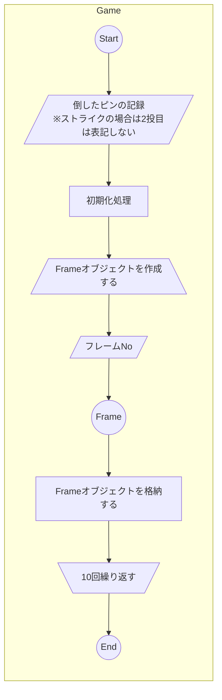
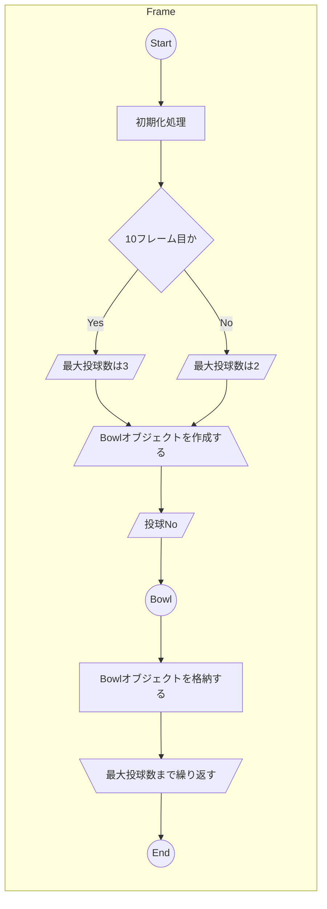
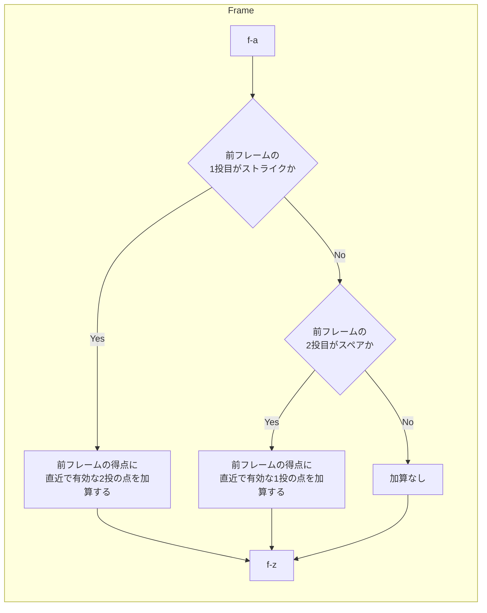

# NOTE

## 登場人物

- ボーリングをする人＜Bowler＞

## 用語

- 1ゲーム＜Game＞は10フレーム＜Frame＞
  - 1ゲームの得点＜score＞は最大で300
  - 1フレームの得点は最大で30
- 1フレームは原則2投＜Bowl＞
  - 10フレーム目に限り、マーク（ストライクまたはスペアのことで、具体的には下記参照）場合のみ3投できる
    - 1投目がストライクだった場合
    - 2投目がスペアだった場合
- ピン＜pin＞の数は10本
  - 1投目で10本倒したらストライク＜strike＞
    - ストライクの場合は2投目は表記しない
    - ストライクのフレームの得点は次フレームの2投の点を加算する
  - 1投目で全て倒せなかった時、2投目で全て倒したらスペア＜spare＞
    - スペアのフレームの得点は次フレームの1投の点を加算する

## 処理フロー

### 初期化

#### Game

#### Frame

#### Bowl

### スコア集計（加算）

#### Frame

